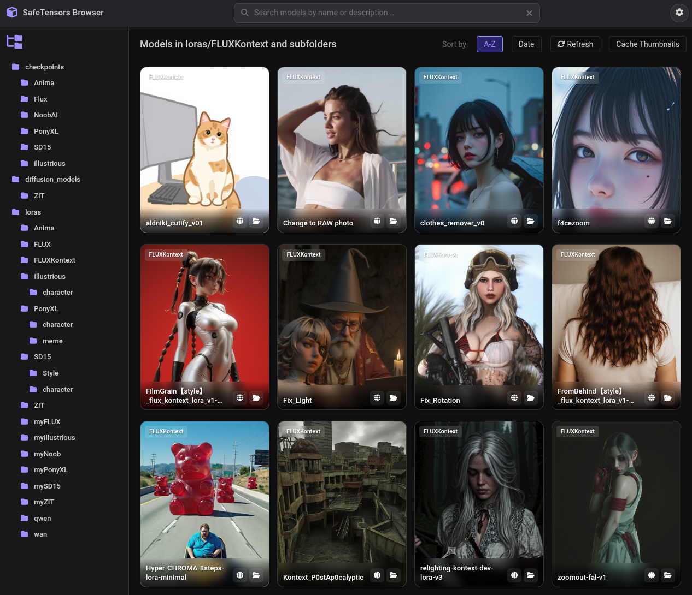
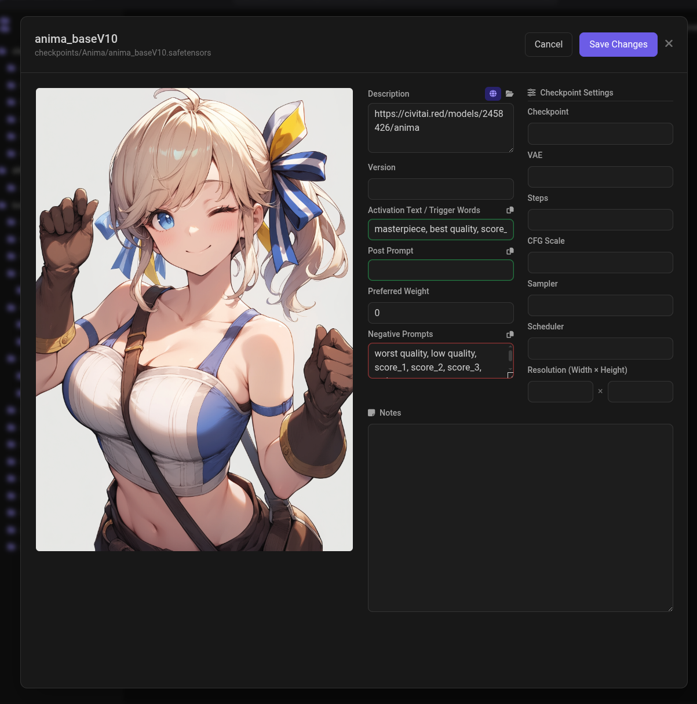

# SafeTensors Model Browser

A standalone web-based gallery for managing and browsing Stable Diffusion models (checkpoints, LoRAs, etc.) with a familiar interface inspired by A1111's model viewer.

## Screenshots

**Gallery view** — folder tree on the left, card grid with frosted-glass footers, per-card globe and folder-open icons:



**Model detail modal** — preview on the left, metadata form on the right with colour-coded prompt fields and a side-by-side checkpoint-settings panel:



## Features

### Backend (Python)
- **HTTP Server**: Lightweight Python-based server that scans your models folder recursively
- **Model Support**: Works with `.ckpt`, `.safetensors`, `.pt`, `.pth`, and `.bin` files
- **Smart Thumbnail Caching**: Generates 512px thumbnails (longest side) with `aig_` prefix in `thumbs/` subfolders. Uses PIL's `thumbnail()` + `draft()` for low memory use and forces regen on each cache pass
- **Drag & Drop Upload**: Upload custom thumbnails for models via drag and drop
- **JSON Metadata**: Store and manage metadata for each model in companion JSON files
- **URL Extraction**: Pulls the first URL out of each model's description so the gallery can link straight to its source page
- **File Explorer Integration**: Open file location directly from the browser
- **Configuration Persistence**: Settings saved to `config.json`

### Frontend
- **Tree Navigation**: Hierarchical folder tree on the left sidebar
- **Gallery Grid View**: Card-based layout inspired by ComfyUI-Lora-Manager, with full-bleed previews and a frosted-glass footer showing the model name
- **Per-card quick actions**:
  - Globe icon — opens the model's source URL in a new tab
  - Folder-open icon — opens the model's location in your system file manager
- **Folder badge & date badge** floating over each thumbnail
- **Polished header**: command-palette-style centered search and a round settings button
- **Search Functionality**: Search models by name or description
- **Sorting Options**: Sort by name (A-Z) or modification date
- **Model Details Modal**: Popup with comprehensive model information including description, SD version, activation text, post prompt, preferred weight, negative text, notes, plus checkpoint-specific settings (checkpoint, VAE, steps, CFG scale, sampler, scheduler, width, height)

### Design
- Dark, OLED-friendly theme with purple accent
- Frosted-glass card footers, hover lift, and smooth transitions
- Responsive grid that adapts from ~180px cards on mobile up to ~280px on 4K displays

## Requirements

- Python 3.6 or higher
- PIL/Pillow (for thumbnail generation)
- Web browser (Chrome, Firefox, Edge, Safari)

## Installation

1. Clone or download this repository
2. Ensure Python 3 is installed on your system
3. Install dependencies (if not already installed):
   ```bash
   pip3 install Pillow
   ```

## Usage

### Linux (Primary Testing Platform)

This project is primarily tested on Linux. To start the server:

```bash
./start_server.sh
```

Make sure the script is executable:
```bash
chmod +x start_server.sh
```

The startup script will:
- Check for Python 3 installation
- Verify required modules
- Clean up any existing server processes on port 8001
- Start the server
- Automatically open your browser to `http://localhost:8001/`

### Windows

```cmd
start_server.bat
```

### Manual Start

```bash
python3 model_server.py
```

Then open your browser to: `http://localhost:8001/`

## Configuration

On first run, click the **Settings** button (⚙️) in the top right corner to configure:

1. **Model Root Directory**: Path to your models folder
   - Example: `/media/simon/4TBDrive/Chris/AI_Master/stable-diffusion-webui-forge/models`

2. **Folder Whitelist**: Comma-separated list of folders to scan
   - Example: `Stable-diffusion,Lora,checkpoints`

3. Click **Save Settings** to persist your configuration

4. Click **Load Files** to scan your models

Configuration is saved to `config.json` in the application directory.

### Default Configuration

```json
{
  "modelRoot": "/path/to/your/models",
  "folderWhitelist": [
    "Stable-diffusion",
    "Lora",
    "checkpoints"
  ]
}
```

## File Structure

```
ModelBrowser/
├── index.html          # Main web interface
├── model_server.py     # Python HTTP server
├── config.json         # Configuration file (created on first save)
├── start_server.sh     # Linux startup script
├── start_server.bat    # Windows startup script
└── README.md           # This file
```

## How It Works

1. **Scanning**: The server recursively scans the model root directory for compatible files
2. **Filtering**: Only folders in the whitelist are displayed
3. **Thumbnails**:
   - Looks for existing PNG files matching model names
   - Generates cached 512px versions (longest side) in `thumbs/` subfolders
   - Falls back to a "No preview" placeholder if no thumbnail exists
4. **Metadata**: Stores model information in JSON files alongside the models
5. **API**: Provides RESTful endpoints for the frontend to fetch data

## Features in Detail

### Thumbnail System
- Original thumbnails: `model_name.png` (stored alongside model)
- Cached thumbnails: `thumbs/aig_model_name.png` (auto-generated)
- Drag & drop to upload custom thumbnails
- "Cache Thumbnails" button to batch-generate cached versions

### Model Information
Each model can store:
- **Description**: General information about the model
- **SD Version**: Which Stable Diffusion version (1.5, 2.0, XL, etc.)
- **Activation Text**: Trigger words or prompts
- **Preferred Weight**: Recommended strength/weight setting
- **Negative Text**: Negative prompts to use
- **Notes**: Any additional information

### File Explorer Integration
Click "Open in Explorer" to:
- **Windows**: Opens Explorer with the file selected
- **macOS**: Opens Finder with the file revealed
- **Linux**: Opens file manager (xdg-open, nautilus, dolphin, or thunar)

## Development Notes

- Primarily developed and tested on **Linux**
- Server runs on port **8001** by default
- CORS enabled for local development
- Supports both local file paths and server-based deployment

## Troubleshooting

### Port Already in Use
If port 8001 is already in use, the `start_server.sh` script will automatically clean it up. Or manually:
```bash
lsof -ti:8001 | xargs kill -9
```

### Permission Denied
Make sure the startup script is executable:
```bash
chmod +x start_server.sh
```

### Thumbnails Not Showing
- Check that thumbnails are named the same as the model file (e.g., `model.safetensors` → `model.png`)
- Use the "Cache Thumbnails" button to generate thumbnails
- Check file permissions on the models directory

### Models Not Appearing
- Verify the Model Root path is correct
- Ensure folder names are in the Folder Whitelist
- Check that files have valid extensions (`.ckpt`, `.safetensors`, etc.)
